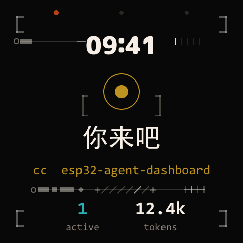
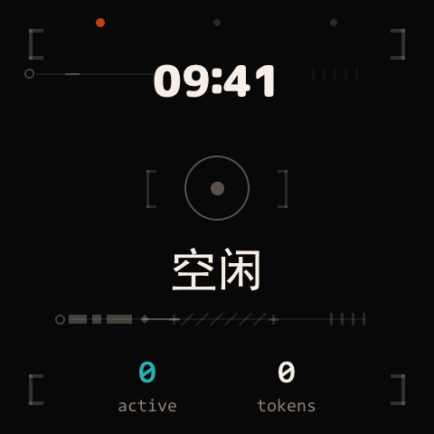
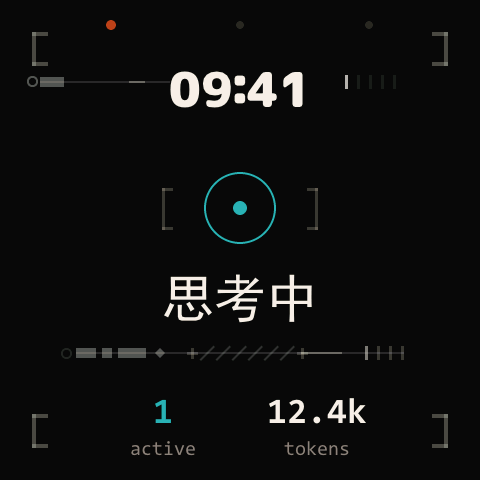
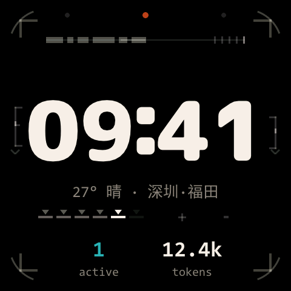
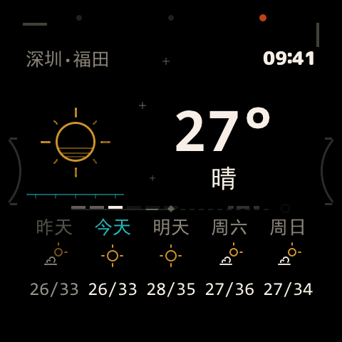
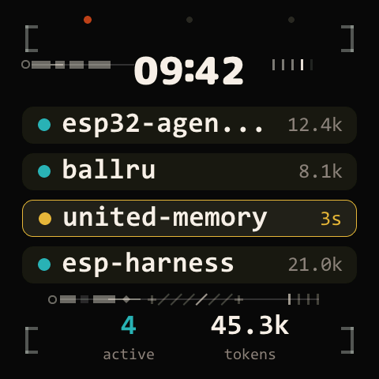

<div align="center">

# esp32-agent-dashboard

**A desk-side panel with one job: telling you the moment your AI agent
hands the turn back.**

The panel turns gold, greets you, and names the project that needs you.
Until then it stays out of your way — a clock, the weather, a quiet ring
breathing in the corner of your eye.

[](https://github.com/Caldis/esp32-agent-dashboard/actions/workflows/ci.yml)
[](./LICENSE)
[](https://docs.espressif.com/projects/esp-idf/)
[](https://lvgl.io/)
[](https://github.com/Caldis/esp-harness)
[](https://caldis.github.io/esp32-agent-dashboard/)

[**Quickstart**](#quickstart) ·
[**The one job**](#the-one-job) ·
[**Three views**](#three-views-three-keys) ·
[**Protocol**](./PROTOCOL.md) ·
[**Homepage**](https://caldis.github.io/esp32-agent-dashboard/) ·
[**1:1 simulator**](https://caldis.github.io/esp32-agent-dashboard/sim/)

<br>



<sub>Every image in this README is a 1:1 capture from the running device.</sub>

</div>

---

## The one job

You run coding agents — Claude Code, Codex, Cursor — in terminals you
aren't looking at. The expensive failure mode isn't the agent being
slow; it's the agent being **done** while you don't notice. Minutes of
model time, lost to "I was in another window."

This panel closes that loop:

```
Claude Code hook  →  host bridge  →  USB serial snapshot  →  the panel pulls
      (Stop)          (daemon)         (one-line JSON)        itself to gold
```

When any agent finishes its turn, the display pulls itself to the
dashboard — one-shot, only on a fresh signal, never for stale state —
and shows a gold ring with a greeting and the project that's waiting:

> **接着来** — *(one of eight rotating words for "your turn")*
> `cc esp32-agent-dashboard`

Key away and it won't nag you again for that round. Reconnect or a new
turn re-arms it. Everything else on the device is deliberately ambience.

## State, not pages

The device-wide colour contract: **colour follows the agents' state,
never the current page.** Gold means your move. Teal means an agent is
thinking. Dim means nothing needs you. One breathing ring is the single
status glyph everywhere — there is no icon zoo to learn.

| | | |
|:-:|:-:|:-:|
|  |  |  |
| **dim** — 空闲, nothing running | **teal** — 思考中, agent working | **gold** — your move, project chip |

The decoration layer keeps the same contract in a second dimension:
it never takes colour, but its **tempo** follows attention — lock-on
sweeps and scan beats run slow when idle, faster while agents run, and
an emphasis sweep crosses the frame the instant a turn comes back.

## Three views, three keys

No menus, no gestures, no mode machinery: three physical keys, one view
each. Pressing the key of the view you're on flashes the frame instead.

| Key | View | What it shows |
|---|---|---|
| **BOOT** | dashboard | The state view above. With 2–4 agents it becomes a fleet of per-project rows; waiting rows carry the gold. |
| **PWR** | clock | Big host-synced clock, today's weather line, active/token footer. Also the retreat view when the host goes silent. |
| **USER** | weather | Today + 4-day forecast, pushed by the bridge (Xiaomi weather route by default, region configurable). |

| | | |
|:-:|:-:|:-:|
|  |  |  |
| **clock** | **weather** | **fleet** — 4 agents, one waiting |

## Under the hood

The firmware is small, but it's built like it matters:

| Layer | What it does |
|---|---|
| **Scenes** (`main/scenes/`) | dashboard / clock / weather on LVGL 9. Content only — chrome, footer and time live in shared layers. |
| **Continuity** (`main/scene_trans.c`) | Every switch is exit → black frame → enter, with real damped-spring LUTs (ζ = 0.68 displacement, 0.92 opacity). The clock is a fixed anchor: it morphs through font rungs, never cross-fades. Identical elements are matched by key across scenes and simply *hold still*. |
| **Decoration** (`main/ui_deco.c`) | A functional-ornament layer under the content: corner brackets, tick groups, segment bars, arcs concentric with the panel corner. Grows/lights per element with a progress value; beats are quantised to the idle refresh tier so ambience never holds the fast clock. Per-scene scores, per-pose masks, data-driven spans (one corner arc sweeps with the minute). |
| **Glow** (`main/ui_glow.c`) | Edge dispersion glow, hand-invalidated bands, radius kept off the animation path (LVGL's corner-mask cache is keyed on radius alone). Also how the panel warns you the host link is stale. |
| **Type** (`main/ui_type.h`) | Five tiers (20/26/36/52/88), sized for 0.6–1 m viewing. No ad-hoc pixel sizes anywhere. |
| **Bridge** (`tools/claude_buddy_bridge.py`) | Self-healing daemon: auto-started by the hooks, single-instance guarded, detects port loss in <1 s, resyncs config + time + snapshot on every reconnect, retreats the device to the clock after configurable silence. Weather poller included. |
| **Text safety** | The device font is a GB2312 subset; the bridge gates every device-bound string through the font's actual cmap, so a missing glyph degrades to ASCII instead of a `.notdef` box. |

The device speaks Chinese out of the box (the greeting table is eight
entries in `main/agent_state.c` — swap the strings and reflash to
localise).

## Wire format

One-line JSON over USB serial; the device replies `OK:` / `ERR:` /
`EVT:`. The full contract is in [`PROTOCOL.md`](./PROTOCOL.md).

| Verb | Purpose |
|---|---|
| `dash snapshot` | Full agent state — the only path that changes what the panel says |
| `dash time` / `dash config` / `dash weather` | Host-pushed clock, device config, weather window |
| `dash scene` / `dash btn` | Manual view switch / physical-key injection (used by tests) |
| `dash health` | Liveness poll |
| `?stat` `?perf` `?deco` `?ghost` | Runtime self-checks: real fps, windowed render timing, decoration A/B, transition-sprite invariants |

## Built by measuring

The repo's engineering culture, in one sentence: **screenshots lie,
timers lie, so every claim gets an instrument.**

- `?perf` reads windowed render / flush-wait / dirty-pixel timing off
  the running device; `fps` is measured at render-ready, not a timer
  counting itself.
- `tools/perf/trans_bench.py` replays every scene transition against a
  committed baseline and fails CI-style (>15 % regression, invariant
  breaks) — because three "obviously right" optimisations made this
  board *slower*, and the dead ends are kept on file
  ([`docs/perf-dead-ends.md`](./docs/perf-dead-ends.md)).
- `tools/perf/deco_audit.py` measures the **negative space** between
  decoration and content per pose — the class of defect golden-image
  diffs can't see.
- The panel itself was mis-specified for months: the spec sheet says
  466×466, and every layout constant believed it. On-device edge rulers
  (`?vis`) proved all 480×480 pixels visible with corner radius 76 —
  and found the 7 px centring error the myth had been paying for.
  Measured, fixed, documented (`main/ui_calib.c` stays in the build for
  the next panel batch).

Numbers that survived the method: weather transition frames −27 %
render time via at-rest pre-compositing; idle repaint −53 %; motion
sampling unlocked from a compile-time 30 Hz cap; the whole decoration
layer costs +7 % render on transition frames and holds the 66 ms idle
tier at rest.

## What we retired

Earlier versions did more, on purpose: a device-side approve/deny
button for permission prompts, a five-kind takeover page, a pet mascot,
BOOT-cycling multi-modal keys. All retired. Decisions belong in the
terminal where the diff is; a panel you must *operate* is another
terminal. What survived is an attention machine: state in, glance out.
The old experiments are archived in `attic/` with their lessons.

## Quickstart

> **Prerequisites:** ESP-IDF v6.0+, a
> [Waveshare ESP32-S3-Touch-AMOLED-2.16](https://www.waveshare.com/esp32-s3-touch-amoled-2.16.htm)
> (~US$30), Python 3.10+.

```bash
# 1. Toolkit (build / flash / console / screenshot CLI)
git clone https://github.com/Caldis/esp-harness
pip install -e esp-harness/tools/esp-harness/

# 2. This repo
git clone https://github.com/Caldis/esp32-agent-dashboard
cd esp32-agent-dashboard

# 3. Build + flash
esp-harness build --project .
esp-harness flash --project . --port COM9        # your serial port

# 4. Start the bridge (or let the hooks auto-start it)
python tools/claude_buddy_bridge.py serve --port-kind serial --port COM9
```

Wire the hooks into `~/.claude/settings.json` — six events, one line
each (`session_start`, `user_prompt_submit`, `pre_tool_use`,
`post_tool_use`, `notification`, `stop`):

```json
{
  "hooks": {
    "Stop": [{ "hooks": [{ "type": "command",
      "command": "python <repo>/tools/hook_dispatch.py stop claude-code" }] }]
  }
}
```

`hook_dispatch.py` auto-starts the bridge when none is running
(`CLAUDE_BUDDY_AUTOSTART=0` opts out) and circuit-breaks on timeouts so
a dead bridge can never stall your Claude Code session. Codex CLI goes
through `tools/codex_wrapper.py` (it has no hook system).

**No board?** The tokeniser-exact TCP mock lets you run everything but
the glass:

```bash
python tools/mock_device_v1.py --port 9876 -v &
python tools/claude_buddy_bridge.py replay tools/sample_session.jsonl --dry-run
```

## Hardware

| | |
|---|---|
| Board | Waveshare ESP32-S3-Touch-AMOLED-2.16 (ESP32-S3R8, 8 MB PSRAM) |
| Panel | 2.16″ AMOLED, **480×480 visible** (measured; the 466×466 spec figure is a myth on this batch), corner radius 76 |
| Link | USB-C serial to the host that runs your agents |
| Keys | 3 physical (BOOT / PWR / USER) |

## Family

| Project | Relation |
|---|---|
| [Caldis/esp-harness](https://github.com/Caldis/esp-harness) | Everything below the app: console protocol, scene framework, build/flash/screenshot CLI. This repo is its first external consumer and its hardest test. |
| [Caldis/claude-dashboard](https://github.com/Caldis/claude-dashboard) | The same glance-value question answered inside the terminal status line. |
| [anthropics/claude-desktop-buddy](https://github.com/anthropics/claude-desktop-buddy) | Ancestor of the wire-protocol shape, and of the idea that desktop agents deserve a physical surface. |

## License

MIT — see [`LICENSE`](./LICENSE).
