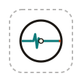
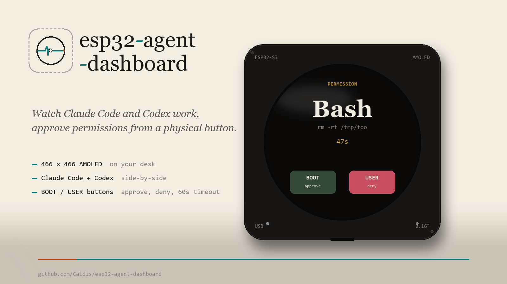
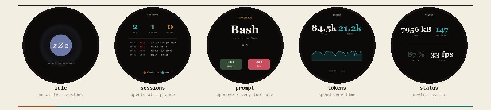
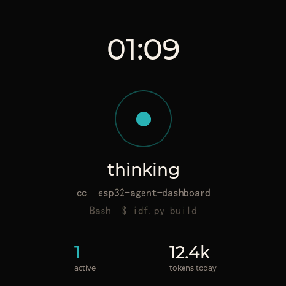
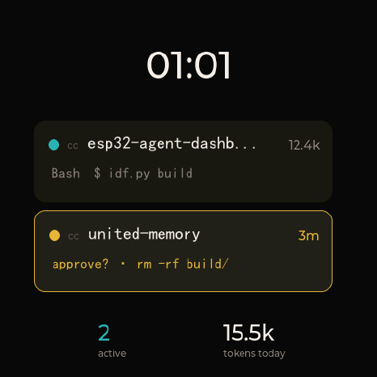
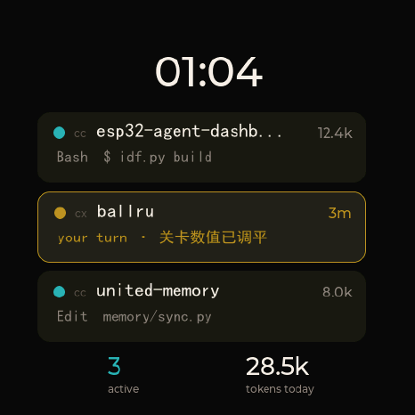
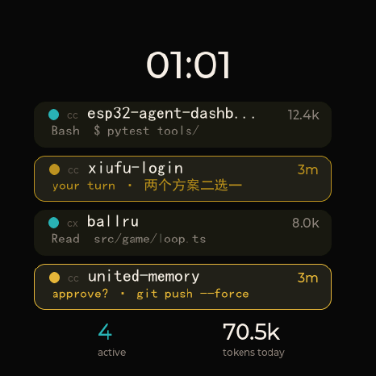
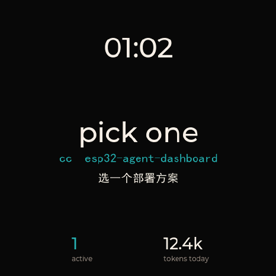
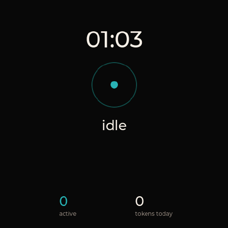
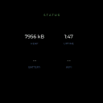

<div align="center">

<picture>
  <source media="(prefers-color-scheme: dark)" srcset="docs/brand/logo-dark.svg">
  
</picture>

# esp32-agent-dashboard

**A live dashboard for AI-agent sessions on a 466×466 AMOLED panel.**

Watch what Claude Code and Codex are doing on your desk in real time.
Approve or deny permission prompts with a physical button. Track token
spend session-by-session. Multi-agent by design.

[](https://github.com/Caldis/esp32-agent-dashboard/actions/workflows/ci.yml)
[](https://github.com/Caldis/esp32-agent-dashboard/releases)
[](./LICENSE)
[](https://docs.espressif.com/projects/esp-idf/)
[](https://lvgl.io/)
[](https://github.com/Caldis/esp-harness)
[](https://caldis.github.io/esp32-agent-dashboard/)

[**Quickstart**](#quickstart-30-seconds) ·
[**What this is**](#what-this-is) ·
[**Scenes**](#scenes) ·
[**Protocol**](./PROTOCOL.md) ·
[**Contributing**](./CONTRIBUTING.md) ·
[**Homepage**](https://caldis.github.io/esp32-agent-dashboard/)

<br>



</div>

---

## What this is

A purpose-built physical dashboard for AI coding agents — Claude Code,
Codex CLI, and friends. It lives next to your keyboard and shows what
your agents are doing without you having to context-switch into the
terminal that owns them. A long-running host bridge funnels hook events
from each agent into a single state view; the device renders the
current state on a 466×466 AMOLED panel and lets you respond to
permission prompts with a physical button.

| Layer | What it gives you |
|---|---|
| **Firmware** (`main/`) | 4 LVGL scenes (dashboard / idle / prompt / awaiting) on the Waveshare ESP32-S3-Touch-AMOLED-2.16. Built on the [esp-harness](https://github.com/Caldis/esp-harness) console protocol + scene framework. Per-agent status pet on the single-agent view. |
| **Host bridge** (`tools/claude_buddy_bridge.py`) | Long-running daemon. Ingests Claude Code hooks (`hook_dispatch.py`) and Codex JSONL (`codex_wrapper.py`). Maintains a per-agent `SessionRegistry`. Pushes throttled snapshots. Circuit-breaker in `hook_dispatch.py` prevents stalling CC on bridge timeouts. |
| **Wire format** ([`PROTOCOL.md`](./PROTOCOL.md)) | One-line JSON over USB-Serial: `dash snapshot`, `dash prompt`, `dash event`, `dash tokens`, `dash idle`. Device replies `OK:` / `ERR:` / `EVT:`. |

For the current build boundary — what ships now vs. scaffold-only files —
see [`docs/CURRENT_ARCHITECTURE.md`](./docs/CURRENT_ARCHITECTURE.md).

## Quickstart (~15 min, longer if you need ESP-IDF)

> **Prerequisites:** ESP-IDF v6.0+ must be installed and activated
> (`source $IDF_PATH/export.sh` / `export.bat` in every new shell).
> First-time install takes 20-40 min — see
> [espressif.com/en/products/sdks/esp-idf](https://www.espressif.com/en/products/sdks/esp-idf).

```bash
# 1. Get the esp-harness toolkit (provides the build / flash / console CLI)
git clone https://github.com/Caldis/esp-harness
pip install -e esp-harness/tools/esp-harness/

# 2. Get this repo
git clone https://github.com/Caldis/esp32-agent-dashboard
cd esp32-agent-dashboard

# 3. Build + flash the firmware (Waveshare ESP32-S3-Touch-AMOLED-2.16)
esp-harness build --project .
esp-harness flash --project . --port COM9   # adjust to your serial port

# 4. Wire the bridge into Claude Code
#    Add to ~/.claude/settings.json:
#    {
#      "hooks": {
#        "PreToolUse":  "python D:/Code/esp32-agent-dashboard/tools/hook_dispatch.py pre_tool_use",
#        "PostToolUse": "python D:/Code/esp32-agent-dashboard/tools/hook_dispatch.py post_tool_use",
#        "Stop":        "python D:/Code/esp32-agent-dashboard/tools/hook_dispatch.py stop"
#      }
#    }

# 5. Start the bridge
python tools/claude_buddy_bridge.py serve --serial-port COM9
# → "[bridge] serving on 127.0.0.1:7321 | dry_run=False | serial=COM9"
```

Now start a Claude Code session. The device wakes from `idle` →
shows the running session → if a `Bash` tool needs approval, the
prompt scene takes over and waits for **BOOT** (approve) or **USER**
(deny). 60 s timeout falls through to "deny" by default.

> **No board?** You can still iterate the bridge against the included
> TCP mock device:
> ```bash
> python tools/mock_device_v1.py --port 9876 -v &
> python tools/claude_buddy_bridge.py replay tools/sample_session.jsonl --dry-run
> ```
> The mock mirrors the firmware's console-protocol tokeniser exactly,
> so anything that talks to the mock will talk to the real device.

For the full end-to-end runbook, see [`docs/E2E_DEMO.md`](./docs/E2E_DEMO.md).
For the integration map, see [`docs/HOST_INTEGRATION.md`](./docs/HOST_INTEGRATION.md).

## Scenes

The dashboard cycles through its scenes, all rendered with LVGL 9.x
on a 466×466 round AMOLED:

<div align="center">

</div>

| Scene | When it shows | What it shows |
|---|---|---|
| **idle** | no active sessions (60 s+ since last event) | gentle "zZz" pulse, dim ring |
| **dashboard** | one or more agents active (ambient default) | v3 adaptive fleet view — 1 agent: breathing pulse + project + live activity line; 2-4 agents: per-agent rows (status dot, project, activity, waiting-duration/tokens), waiting rows glow gold |
| **awaiting** | agent blocked on user input (`Stop` hook), **single-agent only** | kind-specific headline + glyph, marquee summary, numbered options, BOOT/USER affordance on approve. With 2+ agents the fleet rows carry the awaiting state instead (a takeover would hide the other agents) |
| **prompt** | a `PreToolUse` event needs explicit approval | full-screen tool name, command preview, **BOOT** = approve, **USER** = deny, 60 s timeout |
| **tokens** | on demand (`dash tokens`) | cumulative + today's tokens, 24 h sparkline, per-agent breakdown |
| **status** | on demand (`dash event {scene:'status'}`) | heap free, uptime, WiFi state (v2), firmware build |

Captured live (v3 fleet view, real device):

| | | |
|:-:|:-:|:-:|
|  |  |  |
| **1 agent — ambient + activity** | **2 agents** | **3 agents** |
|  |  |  |
| **4 agents (2 waiting, gold)** | **awaiting takeover (single agent)** | **idle** |
|  |  | |
| **tokens** | **status** | |

## How it compares

There's a small but growing space of "physical surfaces for AI agents".
Where this one fits:

| Project | Transport | Agents | Hardware | Permission button |
|---|---|---|---|---|
| [anthropics/claude-desktop-buddy](https://github.com/anthropics/claude-desktop-buddy) | BLE (Nordic UART) | Claude Desktop (single) | reference: nRF / generic BLE | No (display-only) |
| [claude-dashboard plugin](https://github.com/Caldis/claude-dashboard) | in-app status line | Claude Code | none (terminal-resident) | No (no hardware) |
| **esp32-agent-dashboard** *(this repo)* | USB-Serial (v0.1) → BLE NUS (v1.0) → WiFi (v2.0) | Claude Code + Codex (multi-agent) | Waveshare ESP32-S3-Touch-AMOLED-2.16 | **Yes** (BOOT = approve, USER = deny) |

We took the protocol *shape* (JSON-over-line, one verb per state class)
from claude-desktop-buddy and extended it to handle several concurrent
agents at once. The transport choice is different (USB-Serial first
because that's what esp-harness ships with; BLE is on the roadmap,
not a precondition). And the physical button is the point — we wanted
the loop where you glance at the panel and tap to unblock the agent,
not just a passive display.

## Status / roadmap

| Milestone | Status | What ships |
|---|---|---|
| **v0.1** | shipped | USB-Serial multi-agent: 5 scenes, hook bridge for CC + Codex, permission button |
| **v2.5** | shipped | Ambient feed dashboard scene, awaiting takeover with marquee + options |
| **v2.7** *(current)* | shipped | WCAG contrast fixes, motion=reduced config, PUSH banner overlay, circuit breaker, approve BOOT/USER affordance, persona-tested docs |
| **v3.0** | shipped | Harness rename aurora-harness -> esp-harness-core |

We track the consuming-side gaps surfaced against the framework in
[`HARNESS_GAPS.md`](./HARNESS_GAPS.md) — each one feeds back into
esp-harness or becomes a documented recipe. As of v0.1, 2 gaps have
landed upstream and 5 are in design.

## Predecessors and inspirations

| Project | What we took from it |
|---|---|
| [anthropics/claude-desktop-buddy](https://github.com/anthropics/claude-desktop-buddy) | Reference shape of the wire protocol (JSON-over-line, NUS framing). The idea that a desktop AI agent deserves a physical surface. |
| [Caldis/esp-harness](https://github.com/Caldis/esp-harness) | Everything below the application layer — console protocol, LVGL scene framework, host CLI, simulator, build & flash. This project is the first non-Aurora consumer of esp-harness and exists in part to harden the framework. |
| [Caldis/claude-dashboard](https://github.com/Caldis/claude-dashboard) | The information-density question: how much state can you usefully show at one glance? Answers from the terminal-status-line variant of that question carry over to the 466×466 surface. |

## License

MIT — see [`LICENSE`](./LICENSE).

---

<div align="center">

Made with intent, in pursuit of <em>seeing the loop</em>.

</div>
