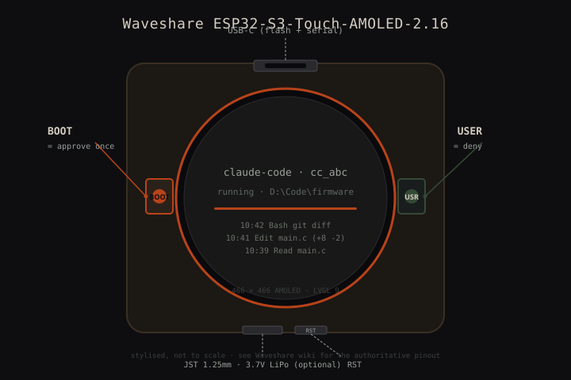
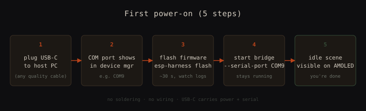

# Hardware Guide

The reference platform is the **Waveshare ESP32-S3-Touch-AMOLED-2.16**.
The whole BOM is one board + one cable. No soldering. If you already have
a USB-C cable on your desk, the second line of the BOM is zero.

<p align="center">
  
</p>

## Shopping list (reference build)

Prices as of **2026-05** — they drift. Treat the right-hand column as
order-of-magnitude.

| # | Part | Why | Where | Approx. price (USD) |
|---|---|---|---|---|
| 1 | **Waveshare ESP32-S3-Touch-AMOLED-2.16** (round 466×466 AMOLED, BOOT + USER buttons, USB-C JTAG, optional LiPo JST) | the firmware is built and tested for this exact board | [waveshare.com/esp32-s3-touch-amoled-2.16.htm](https://www.waveshare.com/esp32-s3-touch-amoled-2.16.htm) — also stocked by [Mouser](https://www.mouser.com/), [Digi-Key](https://www.digikey.com/), and Waveshare's Amazon storefront | **~$42** |
| 2 | USB-C ↔ USB-A (or USB-C) data cable, ≥ 0.5 m, **data-capable** | flashing + serial + power | anywhere; reuse one you have | **~$0 – $8** |
| 3 | 3.7 V LiPo with JST 1.25 mm (e.g. 502035, 350 mAh) — *optional* | cordless desk mode; runs ~4 h on battery for the firmware's noir theme | Adafruit [#1578](https://www.adafruit.com/product/1578) / [#258](https://www.adafruit.com/product/258), or any LiPo with the **correct connector polarity** | **~$8** (skip if you don't want cordless) |
| 4 | Small magnetic stand / 3D-printed cradle — *optional* | keeps the round display upright on the desk | print one (search "ESP32 AMOLED stand" on Printables / Thingiverse) or a generic phone stand works | **~$0 – $10** |

**Reference build total (item 1 + USB-C cable you already own): ~$42.**

**Full build with battery + stand: ~$60.**

> **Connector polarity matters.** The Waveshare board's JST 1.25 mm
> follows the GND-on-left / VBAT-on-right convention used by Adafruit
> LiPos. If your cell is from a Chinese supplier with the opposite
> wiring, swap the pins or you will let out the magic smoke. Plug the
> cell *after* you have flashed the firmware once over USB.

## First power-on checklist

<p align="center">
  
</p>

1. **Plug the board into your PC over USB-C.** The AMOLED should
   illuminate immediately to the Waveshare default demo (factory
   firmware). If nothing lights up: cable is power-only, or the board
   is in download mode. Try a known-good data cable.

2. **Confirm a COM / tty port exists.** Windows: open Device Manager →
   *Ports (COM & LPT)*, expect something like `USB Serial Device
   (COM9)`. macOS / Linux: `ls /dev/tty.usb*` or `ls /dev/ttyACM*`.
   Note the port name — you'll pass it to every subsequent command.

3. **Flash the dashboard firmware.** From the repo root:

   ```bash
   esp-harness flash --project . --port COM9    # adjust port
   ```

   Takes ~30 seconds. The AMOLED clears, the boot animation runs once,
   then the **idle** scene appears (a soft "zZz" pulse on a dim ring).

4. **Start the host bridge.** In a long-lived terminal:

   ```bash
   python tools/claude_buddy_bridge.py serve --serial-port COM9
   ```

   The bridge stays foreground. Expected first line:
   `[bridge] serving on 127.0.0.1:7321 | dry_run=False | serial=COM9`.

5. **Confirm the round-trip.** Drive a snapshot:

   ```bash
   curl -s http://127.0.0.1:7321/snapshot \
     -d '{"agents":[{"kind":"claude-code","session_id":"smoke","status":"running","msg":"hello"}],"totals":{"total":1,"running":1,"waiting":0}}'
   ```

   AMOLED flips **idle** → **sessions** within ~250 ms. Wire CC hooks
   next — see [`GET_STARTED.md`](./GET_STARTED.md).

## Buttons at a glance

All three keys are *optional mode switches* — the device stays fully
host-driven if you never touch them. Only an active permission prompt
gives BOOT/USER a required meaning.

| Button | Ambient (no prompt) | When the prompt scene is showing |
|---|---|---|
| **BOOT** (GPIO 0) | **cycle view** — dashboard ↔ idle (takeover scenes are skipped; pinned while an agent is awaiting) | **approve once** — sends `EVT: permission decision=once` |
| **USER / Key3** (GPIO 18) | **cycle focused agent** — auto → agent 1 → … → auto; pins the dashboard to one agent's detail view (needs a 2+ fleet) | **deny** — sends `EVT: permission decision=deny` |
| **PWR** (AXP2101 PWRON, polled over I2C) | **screen off / on** — any key wakes the panel (the waking press is consumed); a prompt or awaiting state auto-wakes it | ignored (can't darken a live countdown); long-press stays the PMU hardware power-off |
| **RST** (recessed) | hardware reset | hardware reset |

Every switch flashes a toast and emits an EVT (`scene_changed`, `focus
slot=N`, `screen state=off/on`) so the bridge sees what the human did.
Simulate any press without hands: `dash btn <boot|user|pwr>` — same
code path as the physical keys (`main/button_router.c`). GPIO mapping
lives in `main/buttons.c` (`GPIO_BOOT` / `GPIO_USER`); the PWR poller
is `main/pwr_key.c`.

## Alternative boards (untested but plausible)

The firmware is LVGL widgets on top of esp-harness' console-protocol
layer. Any ESP32-S3 with a reasonable framebuffer and two buttons can
probably run it with a sdkconfig tweak and a retheme. None of these
are tested by CI — treat the list as a forecast, not a recommendation.

| Board | What carries over | What you'd have to do | Caveats |
|---|---|---|---|
| **M5Stack Core2** (320×240 IPS, 2 hardware buttons + capacitive) | console-protocol layer, scene framework, mock-device dev loop | swap `LV_HOR_RES` / `LV_VER_RES` in sdkconfig, retheme to landscape, remap GPIOs for the two buttons in `main/buttons.c` | smaller pixel budget; the tokens sparkline + sessions list will need re-layout |
| **LilyGO T-Display-S3** (320×170 ST7789) | same firmware skeleton | landscape theme, repoint backlight GPIO, button remap | only 1 user button on stock; needs an external switch for the second permission key |
| **LilyGO T-Display-S3 AMOLED** (536×240 AMOLED) | console-protocol layer + scene framework + AMOLED driver class | landscape theme; tighter horizontal-strip layouts; button remap | closest in spirit to the reference board; protocol stays identical |
| **Waveshare ESP32-S3-LCD-1.85** (round 360×360 ST7789) | console-protocol layer + scene framework | swap display driver, retune palette for non-AMOLED contrast | not OLED — black-pixel-is-off goes away; the noir theme will look washed |
| **Generic ESP32-S3 dev kit + your own panel** | console-protocol layer | bring your own display driver + your own buttons | this is "use esp-harness directly", not "use this dashboard" |

For all of them the **wire protocol** ([`PROTOCOL.md`](../PROTOCOL.md))
is identical — the host bridge does not know or care which board it
addresses.

## When something goes wrong

See [`TROUBLESHOOTING.md`](./TROUBLESHOOTING.md) — the top-5 failure
modes (COM port, ESP-IDF v6 build, stuck on idle, button doesn't
approve, all snapshots ERR) are all documented with fixes.
