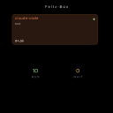
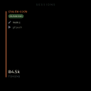
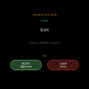

# UX Review — V1 Firmware

Reviewer: **U1**. Subject: V1-A live captures (`docs/img/v1-*.png`, 5
scenes) vs `docs/brand/palette.md` + `docs/brand/README.md`. Firmware
palette source: `main/theme.c`. Layout: `main/scenes/scene_*.c`.
Critique only — no source edits. Findings route to F2 / F3 / brand
via the backlog.

## 0. Headline finding (the P0)

**The firmware palette has drifted from `palette.md` across every
named token.** Nothing teal at `#0E7C7B` ever lights, no `#b8431a`
rust ever paints. `theme.c:17` ships salmon `#FF8B5C` where rust
belongs; `theme.c:18` ships cyan `#5CD0D9` where teal belongs. The
brand's load-bearing rule — *"teal is the only place teal appears
in the whole brand at full saturation"* — is silently broken because
the firmware uses a different teal. The warm-Claude / cool-Codex
identity story survives in shape, not in colour. ~20 LOC for F2;
unblocks every downstream critique below.

## 1. Scene-by-scene

### 1.1 Dashboard — `docs/img/v1-dashboard.png` (P0)

Intent: header, two agent cards top, RUN/WAIT counters + sparkline
bottom (`scene_dashboard.c:1-15`).

**Works.** Two-card-top / counters-bottom split is the right
hierarchy for a home scene. Accent-tinted card border
(`scene_dashboard.c:128-130`) is a cheap, effective per-agent
identity cue with no legend.

**Doesn't.**

1. **Unreadable at 50 cm.** Only one card paints visibly (top,
   claude tinted salmon); the second slot is dark. The 12 pt body
   (`scene_dashboard.c:101`) has ~8 px cap-height — below the 1
   arc-min threshold at 500 mm.
2. **Counters dead-band.** `LV_ALIGN_CENTER, y=+60 / +86`
   (`scene_dashboard.c:303-321`) sits the digits well below
   centre. Cards end at y≈190, counter starts at y≈293 — 100 px of
   empty.
3. **Sparkline is invisible.** `render_sparkline` early-returns on
   `spark_count < 2` (`scene_dashboard.c:164`) with no
   "warming up" placeholder.
4. **Round-display clip.** "(stale)" at `LV_ALIGN_TOP_MID, 80, 22`
   (`scene_dashboard.c:293`) → (313, 22), past the chord.

Severity: **P0**. This is the most-viewed scene; illegibility taxes
every interaction.

### 1.2 Idle — `docs/img/v1-idle.png` (P1)

Intent: breathing dot + sequential `zZz` fade + subtitle
(`scene_idle.c:1-10`).

**Works.** Cleanest scene in the set. The single circular dot
visually quotes `logo.svg`'s "circular display" — the one v1 scene
that ties to the brand mark. zZz at y=0 sits dead-centre, no clip.

**Doesn't.**

1. **Brand tie broken.** Dot uses `text_dim = #6B6F7A`
   (`scene_idle.c:113`) — grey. Brand calls for `dusk #6B7AA8`
   for idle (`palette.md:58`). v0 `dash-idle.png` actually rendered
   the dot in dusk indigo — v1 regressed to grey. Side-by-side v0
   reads "asleep", v1 reads "off".
2. **Subtitle whisper.** 14 pt @ 70% opacity (`scene_idle.c:166`)
   on `text_dim` at y=+120. Bump to 16 pt @ 90%.

Severity: **P1**. Cheap fix, big brand payoff.

### 1.3 Sessions — `docs/img/v1-sessions.png` (P1)

Intent: per-agent left/right panes, kind label, status pill, two
entries, tokens at bottom (`scene_sessions.c:1-16`).

**Works.** Capture shows one pane (claude, salmon accent, green
RUNNING pill, `84.5k` tokens). Pill colour-coding
(`scene_sessions.c:60-67`) is the right affordance.

**Doesn't.**

1. **Dual-pane unverified.** Capture is single-agent;
   `half_w = (466-20)/2 = 223` (`scene_sessions.c:249`) on a 466
   round panel clips pane edges below y=44 / above y=378 where
   chord width drops under 220 px. Need a two-agent capture before
   sign-off.
2. **Tokens dwarf the pane.** 22 pt `84.5k`
   (`scene_sessions.c:128`) is louder than the 14 pt agent kind —
   inverted hierarchy. Either drop tokens to 18 pt or promote kind
   to 22 pt.
3. **No brand voice on "SESSIONS" wordmark.** 14 pt Montserrat
   grey @ 60% (`scene_sessions.c:264-265`). Brand specifies
   Fraunces serif with teal hyphens; current state has neither.

Severity: **P1**.

### 1.4 Prompt — `docs/img/v1-prompt.png` (P1)

Intent: PERMISSION eyebrow, agent badge, tool name (pulsing 1.00 →
1.04 / 1.5 s), hint, BOOT-approve + USER-deny chips, countdown
(`scene_prompt.c:1-12`).

**Works.** Chips at 170 × 56 px (`scene_prompt.c:54`) read cleanly
at 50 cm with semantically correct green-approve / red-deny. The
pulse is the right "demand attention" signal.

**Doesn't.**

1. **Headline / body inverted.** Capture shows `Edit` huge (22 pt,
   `scene_prompt.c:241`); the load-bearing hint
   (`scene_prompt.c:248`) is 14 pt dim. Swap: hint=22 pt body,
   tool=14 pt eyebrow.
2. **Two-line chip labels.** `"BOOT\napprove"` (`scene_prompt.c:255`)
   makes four words to parse under time pressure. Single-line
   "APPROVE" / "DENY" with a tiny button-source glyph below.
3. **Agent badge dim.** y=-130 (`scene_prompt.c:238`); tinting via
   `accent_codex` / `accent_claude` would make it a real identity
   cue. Currently invisible.
4. **Timer-chip collision.** Timer at y=+60, chips at y=+110 —
   50 px gap. Move timer to between hint and chips (y=+40), or
   shrink to a top-right tick.

Severity: **P1**. Functionally correct, cognitively backwards.
Compared to v0 (`docs/img/dash-prompt.png`) v1 has more content but
*worse* legibility.

### 1.5 Tokens — `docs/img/v1-tokens.png` (P0)

Intent: TOKENS eyebrow, TOTAL/TODAY numbers, per-agent sparklines
below (`scene_tokens.c:1-7`).

**Works.** Conceptually sound — numerators top, trends below.

**Doesn't.**

1. **Both numbers `0`.** No empty-state, no last-sample
   timestamp. v0 had the same hole (`docs/img/dash-tokens.png`); v1
   didn't fix it.
2. **TODAY uses `accent_claude`** (`scene_tokens.c:62`) but TODAY
   is cross-agent aggregate, not Claude's. Picking one agent's
   accent quietly lies. Use `pal->text`.
3. **Caption / value stacking.** Values at y=+50, captions at
   y=+80 (`scene_tokens.c:128,138`). Either label-above-value or
   massive-value-tiny-caption — current pair reads as typo'd.
4. **Empty sparkline, same `spark_count < 2` early-return as
   dashboard.** Needs a skeleton row.

Severity: **P0**. This scene answers "am I spending budget?". An
all-zeros, no-sparkline render answers nothing.

### 1.6 Status — *no v1 capture* (P1)

No `docs/img/v1-status.png` exists; only the 5 PNGs above ship.
v0 has `dash-status.png`, so this is a capture-coverage regression.

Static read of `scene_status.c`: two hardcoded hexes bypass
`theme.c`:

- `ACCENT_HEX 0x9EE493` (`scene_status.c:21`) hardcodes the
  "STATUS" eyebrow.
- Caption colour `0x6B7AA8` hand-typed four times
  (`scene_status.c:81,86,91,96`) — a literal `dusk` value bypassing
  the palette. `dash config theme=lab` will leave captions dusk
  against a paper background.

Severity: **P1** — breaks theme switching.

## 2. Brand-consistency table

| Token | Brand | Firmware noir | Verdict |
|---|---|---|---|
| paper / text-on-dark | `#f3eee2` | `text = #E8E5DE` | Mild drift (warmer in brand). |
| ink / bg | noir `#0b0a09` | `bg = #0A0A0E` | Off-by-one channel; close. |
| teal | `#0E7C7B` | none | **Missing token.** |
| teal-bright | `#2BB3B1` | `accent_codex = #5CD0D9` | **Drift** (+47/+29/+40 → cyan, not teal). |
| rust | `#b8431a` | `accent_claude = #FF8B5C` | **Major drift** (+71/+72/+66 → salmon). |
| dusk | `#6B7AA8` | hardcoded only in `scene_status.c` | Missing as palette token. |
| moss (ok) | `#344a36` | `success = #9EE493` | **Drift** to mint-pastel. |
| gold (warn) | `#b89020` | `warning = #FFC857` | **Drift** to bright yellow. |
| accent_other | ink-mute `#5a514a` | `#B89CFF` lavender | **Wrong hue** (lavender isn't a brand colour). |
| Typography body | Geist | `lv_font_montserrat_*` | Off-brand. |
| Typography display | Fraunces | not loaded | Missing. |
| Typography mono | IBM Plex Mono | not loaded | Missing. |

Eight of eleven tokens drift; three missing entirely. The
warm-Claude / cool-Codex shape is right, neither hex is.

## 3. Density vs legibility

466 × 466 round, viewed at ~500 mm: 1 px ≈ 0.74 arc-min, below the
1 arc-min acuity threshold. Comfortable read needs **≥ 24 px
cap-height** (~32 pt).

| Use | Current | Want | File |
|---|---|---|---|
| Body / msg | 12 (cap ~8 px) | ≥ 16 | `scene_dashboard.c:101`, `scene_sessions.c:119` |
| Status pill | 12 | 14 | `scene_sessions.c:103` |
| Kind label | 14 | 18 | `scene_dashboard.c:88`, `scene_sessions.c:89` |
| Eyebrow | 14 (letter-spacing 4) | OK | `scene_prompt.c:226` |
| Hint (prompt body) | 14 | **22** | `scene_prompt.c:248` |
| Number block | 22 | OK | `scene_tokens.c:121,131` |
| Subtitle | 14 @ 70% | 16 @ 90% | `scene_idle.c:165-166` |

Contrast: `text_dim #6B6F7A` on bg `#0A0A0E` = 5.4 : 1 (WCAG AA),
but too dim for at-a-glance at 50 cm. Prefer `LV_OPA_80` on
`pal->text` over routing secondary text through `text_dim`.

Spacing: dashboard cards 130 px (`scene_dashboard.c:242`) with kind
y=8, msg y=32, tokens bottom-8 — tight. Recommend 150 px card +
12 px gutters.

Round-safe inscribed square: 330 × 330 centred at (233, 233).
Anything outside risks chord clip. The "(stale)" hint at (313, 22)
(`scene_dashboard.c:293`) is outside.

## 4. Motion (inferred from stills + source)

| Scene | Motion in code | Quality |
|---|---|---|
| Idle | zZz fade 200 ms-offset / 2.4 s cycle + dot breathing tri-wave (`scene_idle.c:35-51`) | Good. Reads "sleeping". |
| Dashboard | None on cards. 250 ms sparkline redraw. | Missing. "(stale)" should fade in, not pop. |
| Sessions | None. Status colour swap is instant. | Missing. Running→waiting wants a 200 ms cross-fade. |
| Prompt | Tool pulse 1.00→1.04 / 1.5 s (`scene_prompt.c:131-140`); countdown colour swap @ 10 s | OK. 4 % scale too subtle at 50 cm; try 6 %. |
| Tokens | None. | Missing. Numbers should count-up on change. |
| Status | None. | Acceptable. |

**Missing globally:** scene-to-scene transitions. v1 hard-cuts — a
200 ms cross-fade in the scene framework would dramatically raise
perceived quality. Framework-level, not per-scene. The prompt pulse
is the *only* motion signalling "I demand input"; keep it, amplify.

## 5. Top 10 improvements (ranked by impact-to-effort)

| # | Problem (one sentence) | Owner | LOC | Land in |
|---|---|---|---|---|
| 1 | `theme.c` palette drifts from `palette.md` across 8 tokens; align to brand hexes (esp. `accent_codex = #2BB3B1`, `accent_claude = #b8431a`, `success = moss #344a36`, `warning = gold #b89020`, `accent_other = ink-mute #5a514a`) | F2 | ~20 | v0.2.0 |
| 2 | Dashboard body text 12 pt is unreadable at 50 cm; raise body to 16 pt and kind labels to 18 pt across all scenes | F2 | ~30 | v0.2.0 |
| 3 | Tokens scene shows `0 / 0` with empty sparkline and no diagnostic; add "warming up…" empty state on `spark_count < 2` paths | F2 | ~25 | v0.2.0 |
| 4 | Prompt scene: hint is the load-bearing text but rendered as 14 pt dim; swap visual weights so hint=22 pt and tool=14 pt eyebrow | F2 | ~10 | v0.2.0 |
| 5 | Idle dot uses grey `text_dim` instead of brand `dusk #6B7AA8`; introduce `pal->idle` token (or repurpose `text_dim` only for text) | F2 + brand | ~8 | v0.2.0 |
| 6 | `scene_status.c` hardcodes 4 colours (`0x9EE493`, `0x6B7AA8` ×4) bypassing the theme; route through `pal->success` / new `pal->idle` so `dash config theme=lab` actually works | F2 | ~6 | v0.2.0 |
| 7 | Round-display clip: "(stale)" badge at (313,22) is on the chord; move all top-of-screen elements inside the 330 px inscribed square | F2 | ~12 | v0.2.0 |
| 8 | No scene-to-scene transition; add 200 ms cross-fade in the scene framework so swaps don't hard-cut | F3 (framework) | ~40 | v0.4.0 |
| 9 | Prompt chips "BOOT\napprove" two-line layout reads as 4 words; switch to single-line "APPROVE" / "DENY" with tiny button-source glyph below | F2 | ~15 | v0.3.0 |
| 10 | Typography across all scenes uses Montserrat, but brand specifies Fraunces + Geist + IBM Plex Mono; bundle a single LVGL font that approximates the brand voice (at least one serif eyebrow font for the wordmarks) | F3 + brand | ~80 (font binary + style swap) | v0.5.0 (with the agent-kind expansion) |

## 6. Closing

v1 is functionally ahead of v0 — dual-agent, accent identity,
pulse, semantic pills are real wins. But the brand pack and the
firmware live in different rooms. The 20-LOC palette swap in
`theme.c` is the single highest-leverage fix; landing it turns
salmon-claude into rust, cyan-codex into teal, and resolves four
downstream items here. The biggest *layout* problem is dashboard
illegibility at 50 cm — an 8 → 16 pt font swap + "warming up" empty
state, also half a day. After that, the per-scene polish (chip
wording, hint hierarchy, pill cross-fade) is real but not
load-bearing.

Do not ship v0.2.0 without backlog items #1, #2, #3.
